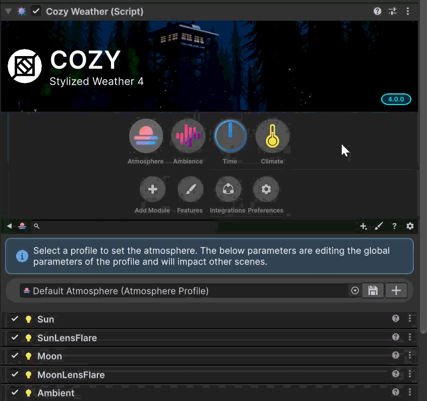

# Features

Rather than always rendering every possible option, COZY 4 saves rendering cycles using a renderer feature system. Each feature describes a complete aspect of a shader within COZY that can be toggled or used on its own. Features **cannot** be toggled at runtime, [#styles](./#styles "mention") should be used instead.

## Toggling Features

Use the paintbrush icon <i class="fa-paintbrush" style="color:blue;">:paintbrush:</i> to open the features menu

<figure><figcaption></figcaption></figure>

Each feature can be independently toggled. When the feature is off, it will be automatically skipped during rendering.

<figure><figcaption></figcaption></figure>

## Styles

A style is a collection of feature toggles setup for a particular target. Use these to toggle features dynamically at runtime

### Setting up Styles

By default, COZY 4 comes with two style options (Desktop & Mobile) but more can be created for other quality levels. Use the plus icon <i class="fa-plus" style="color:blue;">:plus:</i> to add a new style to the list.

### Changing Styles in C\#

```csharp
// Set via name
string styleName = "Mobile";
CozyPreferences.SelectStyle(styleName);

// Set via ID
int styleID = 0;
CozyPreferences.SelectStyle(styleID);

// Always call this after changing styles to rewrite the feature keywords
CozyWeather.Instance.ResetQuality();
```

### Getting Styles in C\#

```c#
// Gets the current style
CozyStyle style = CozyPreferences.CurrentStyle;

// Get a specific feature's toggle state in the current style
bool useSunLightFeature = CozyPreferences.CurrentStyle.UseLightingSun;
```
