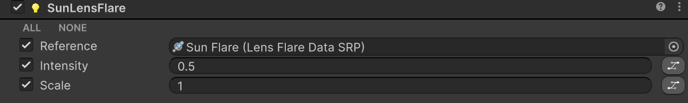

# Lighting

## Sun

<figure><figcaption></figcaption></figure>

Controls the sun light. Set the color, intensity, shadow settings, and angle options

<table><thead><tr><th width="128.3333740234375">Name</th><th width="101.6666259765625">Type<select><option value="ohaqqN1Yesqr" label="color" color="blue"></option><option value="RVqHPbO5fGTv" label="float" color="blue"></option><option value="8JX7TqvmW1aO" label="select" color="blue"></option><option value="7yfJFUCrfbFF" label="bool" color="blue"></option></select></th><th>Description</th></tr></thead><tbody><tr><td>lightColor</td><td>color</td><td>Sets the color of the sun light at a certain time. Starts and ends at midnight.</td></tr><tr><td>lightIntensity</td><td>float</td><td>Sets the intensity of the sun light</td></tr><tr><td>shadowType</td><td>select</td><td>Select what type of shadows will be used for the sun light. Use this to toggle shadows off.</td></tr><tr><td>shadowIntensity</td><td>float</td><td>Set the intensity of the shadows for the sun light</td></tr><tr><td>minAngle</td><td>float</td><td>Sets a minimum angle for the light direction. Use this to prevent the sun or moon light from dropping below the horizon (does not impact the visual sun in the sky or the lens flare). Prevent long shadows</td></tr><tr><td>quantize</td><td>bool</td><td>Should the sun light angle be quantized. Quantization makes the light angle move in discrete steps rather than continuously.</td></tr><tr><td>quantizeAngle</td><td>float</td><td>Set a minimum angle to quantize the light angle.</td></tr></tbody></table>

## Sun Lens Flare

<figure><figcaption></figcaption></figure>

<table><thead><tr><th width="128.3333740234375">Name</th><th width="101.6666259765625">Type<select><option value="ohaqqN1Yesqr" label="color" color="blue"></option><option value="RVqHPbO5fGTv" label="float" color="blue"></option><option value="8JX7TqvmW1aO" label="select" color="blue"></option><option value="7yfJFUCrfbFF" label="bool" color="blue"></option><option value="Q0we15xaqlYW" label="LensFlareDataSRP" color="blue"></option></select></th><th>Description</th></tr></thead><tbody><tr><td>reference</td><td>LensFlareDataSRP</td><td>Sets the flare used by the sun</td></tr><tr><td>intensity</td><td>float</td><td>Sets the intensity of the sun lens flare</td></tr><tr><td>scale</td><td>float</td><td>Set the scale of the lens flare</td></tr></tbody></table>

## Moon

<figure><figcaption></figcaption></figure>

Controls the moon light. Set the color, intensity, shadow settings, and angle options

<table><thead><tr><th width="128.3333740234375">Name</th><th width="101.6666259765625">Type<select><option value="ohaqqN1Yesqr" label="color" color="blue"></option><option value="RVqHPbO5fGTv" label="float" color="blue"></option><option value="8JX7TqvmW1aO" label="select" color="blue"></option><option value="7yfJFUCrfbFF" label="bool" color="blue"></option></select></th><th>Description</th></tr></thead><tbody><tr><td>lightColor</td><td>color</td><td>Sets the color of the moon light at a certain time. Starts and ends at midnight.</td></tr><tr><td>lightIntensity</td><td>float</td><td>Sets the intensity of the moon light</td></tr><tr><td>shadowType</td><td>select</td><td>Select what type of shadows will be used for the moon light. Use this to toggle shadows off.</td></tr><tr><td>shadowIntensity</td><td>float</td><td>Set the intensity of the shadows for the moon light</td></tr><tr><td>minAngle</td><td>float</td><td>Sets a minimum angle for the light direction. Use this to prevent the sun or moon light from dropping below the horizon (does not impact the visual sun in the sky or the lens flare). Prevent long shadows</td></tr><tr><td>quantize</td><td>bool</td><td>Should the sun light angle be quantized. Quantization makes the light angle move in discrete steps rather than continuously.</td></tr><tr><td>quantizeAngle</td><td>float</td><td>Set a minimum angle to quantize the light angle.</td></tr></tbody></table>

## Moon Lens Flare

<figure><figcaption></figcaption></figure>

<table><thead><tr><th width="128.3333740234375">Name</th><th width="101.6666259765625">Type<select><option value="ohaqqN1Yesqr" label="color" color="blue"></option><option value="RVqHPbO5fGTv" label="float" color="blue"></option><option value="8JX7TqvmW1aO" label="select" color="blue"></option><option value="7yfJFUCrfbFF" label="bool" color="blue"></option><option value="Q0we15xaqlYW" label="LensFlareDataSRP" color="blue"></option></select></th><th>Description</th></tr></thead><tbody><tr><td>reference</td><td>LensFlareDataSRP</td><td>Sets the flare used by the moon</td></tr><tr><td>intensity</td><td>float</td><td>Sets the intensity of the lens flare</td></tr><tr><td>scale</td><td>float</td><td>Set the scale of the lens flare</td></tr></tbody></table>

## Ambient

<figure><figcaption></figcaption></figure>

Sets the ambient lighting color, mode and intensity.&#x20;

> Ambient light, also known as diffuse environmental light, is light that is present all around the Scene and doesn’t come from any specific source object. It can be an important contributor to the overall look and brightness of a scene.
>
> [Unity Documentation](https://docs.unity3d.com/6000.5/Documentation/Manual/lighting-ambient-light.html)

<table><thead><tr><th width="128.3333740234375">Name</th><th width="101.6666259765625">Type<select><option value="ohaqqN1Yesqr" label="color" color="blue"></option><option value="RVqHPbO5fGTv" label="float" color="blue"></option><option value="8JX7TqvmW1aO" label="select" color="blue"></option><option value="7yfJFUCrfbFF" label="bool" color="blue"></option><option value="Q0we15xaqlYW" label="LensFlareDataSRP" color="blue"></option></select></th><th>Description</th></tr></thead><tbody><tr><td>ambientMode</td><td>select</td><td>Set the ambient lighting mode</td></tr><tr><td>zenithColor</td><td>color</td><td>Sets the color of the zenith ambient lighting</td></tr><tr><td>horizonColor</td><td>color</td><td>Sets the color of the horizon ambient lighting</td></tr><tr><td>groundColor</td><td>color</td><td>Sets the color of the ground ambient lighting</td></tr><tr><td>intensity</td><td>float</td><td>Multiplies the intensity of the ambient lighting</td></tr></tbody></table>
