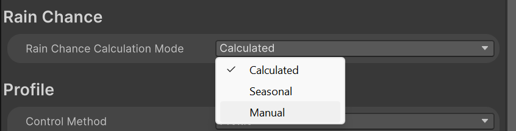
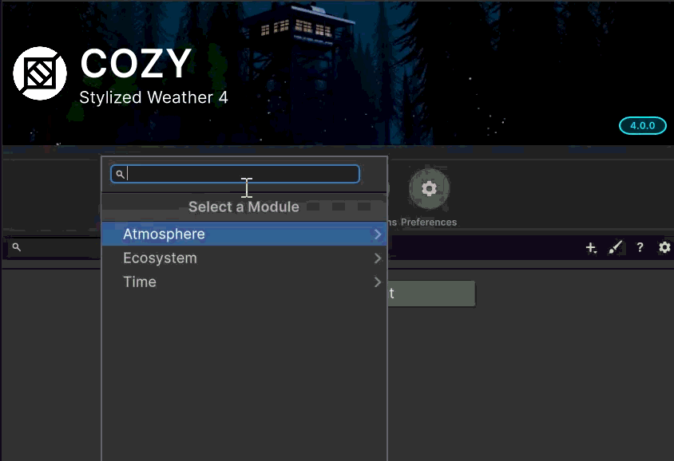
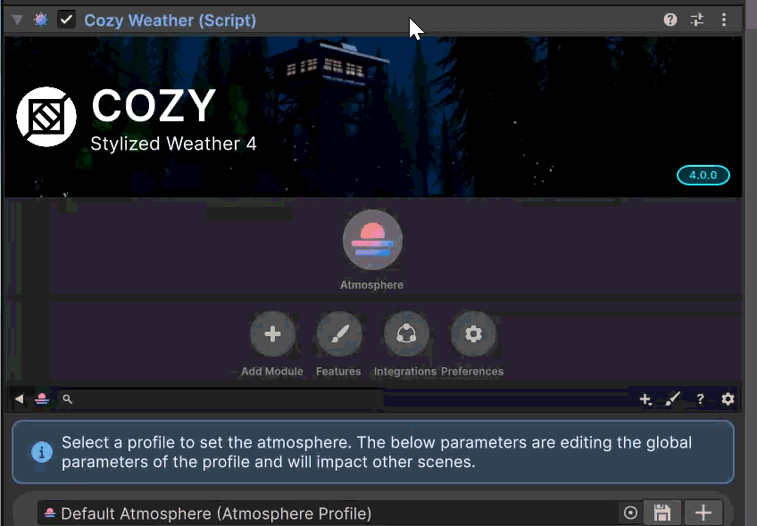

# Modules

## What is a Module?

Modules are systems that take static data from [profiles](../profiles/ "mention") and use that data to change the final effect of COZY as a system. They serve as the fundamental building blocks of logic for COZY and work as independent systems.

> A module is made up of one or more interfaces that define a feature set within COZY. For example, the [time-module](time-module/ "mention") implements ITimeModule (which controls the time of day), ICalendarModule (which controls the date), and ICalendarEventsModule (which stores and manages [meridiemevent.md](../data-structures/meridiem-architecture/meridiemevent.md "mention")). The purpose of this is so that you can combine, overload, or separate any feature set that you need to for your project.

## Managing Mod&#x75;_&#x6C;_&#x65;s

### Adding a Module

A brand new COZY instance will either come pre-loaded with 4 basic modules or completely empty. Modules are _not_ designed to be added or removed at runtime rather as part of a COZY instance.

To add a module using the UI, first [create a new COZY instance](../../setup/scene-setup.md) if you haven't already. Then use the add module button to open a dropdown of available modules.

<figure><figcaption></figcaption></figure>

Select the module that you want to add from the list, and it will appear as a part of your COZY instance

<figure><figcaption></figcaption></figure>

This process is also the same for biomes, but does have a smaller selection of modules to choose from (see [biomes.md](../biomes.md "mention"))

### Removing a Module

To remove a module, simply right click on the module icon and select remove from the dropdown

<figure><figcaption></figcaption></figure>

### Building Your Own Modules

See more here: [build-a-module.md](../../extending-cozy/build-a-module.md "mention")

## API

### Access Modules in C\#

Just like getting a component, the best practice when accessing modules is to cache them once to prevent accessing overhead at runtime. For this example we will be using the [cozy-instance.md](../cozy-instance.md "mention")

```csharp
// Grab the Time Module
private CozyTimeModule time;

void Awake() {
    // You can alsos grab directly from the Instance. 
    // We use this line to make it easy to swap in a custom biome in the future
    CozySystem moduleHolder = CozyWeather.Instance;
    moduleHolder.GetModule(out time);
}
```

There are also several precached module interfaces on the instance that can be grabbed when needed. When creating your own modules that implement module interfaces, these will automatically be reassigned to your custom modules.

```csharp
// Each of these are cached module interfaces
CozyWeather.Instance.Atmosphere;
CozyWeather.Instance.Climate;
CozyWeather.Instance.Precipitation;
CozyWeather.Instance.Weather;
CozyWeather.Instance.Seasons;
CozyWeather.Instance.Time;
CozyWeather.Instance.Calendar;
CozyWeather.Instance.Atmosphere;
CozyWeather.Instance.Wind;
```


NOTE: these are only cached on the Instance and not on other COZY systems like biomes.

