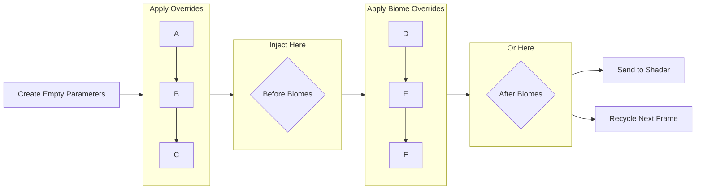

# Atmosphere Module

<a href="https://github.com/DistantLandsProductions/com.distantlands.cozyweather.core/blob/main/Runtime/Modules/CozyAtmosphereModule.cs" class="button secondary" data-icon="code">View on GitHub</a>

The Atmosphere Module is the core system that manages all visual aspects of the sky, fog, clouds, and lighting in COZY. This module controls the most important aesthetic features of your weather system, including sky gradients, celestial bodies, cloud layers, and environmental lighting.

## Overview

The Atmosphere Module works by collecting parameters from atmosphere profiles and biomes, then propagating these values to Unity's shader system. The module handles:

* **Sky Rendering**: Gradient skies, two-tone skies, stars, constellations, galaxy, rainbows, light columns, and shooting stars
* **Celestial Bodies**: Sun and moon disk rendering with configurable appearance and orbital mechanics
* **Fog Systems**: Multiple fog types including gradient fog, volumetric fog, height-based fog, and two-tone fog
* **Cloud Layers**: Volumetric clouds and procedural 2D cloud layers
* **Lighting**: Sun and moon light management, ambient lighting, lens flares, and shadow configuration

### Static Data

The atmosphere module only applies data in the form of [atmosphere-profile.md](../../profiles/atmosphere-profile.md "mention")s. These are static collections of atmosphere data that _do not change at runtime_. Each instance of an atmosphere profile is directly tied to data saved in your project.


For ease of use, the overrides included in an atmosphere module are exposed in the inspector for the atmosphere module once it is assigned. This means that editing atmosphere overrides in the Atmosphere module do not only apply to that specific instance of COZY and will apply to any other system using that atmosphere profile!


### Lifecycle

Every frame, interpolated data from the dynamic fields in the atmosphere profile are bundled in an Atmosphere Parameters struct. This is then passed through the module throughout the duration of the frame and then passed to the shader. The parameters data is then recycled the following frame to prevent GC.



## Usage Examples

<details>

<summary>Access Current Atmosphere Parameters</summary>

```csharp
// Get the atmosphere module
CozyAtmosphereModule atmosphereModule = CozyWeather.Instance.Atmosphere;

// Access current parameters
AtmosphereParameters currentParams = atmosphereModule.Parameters;

// Get specific values
Color skyZenith = currentParams.skyGradientZenithColor;
float sunIntensity = currentParams.lightingSunLightIntensity;
```

</details>

<details>

<summary>Monitor Celestial Directions</summary>

```csharp
// Get the atmosphere module
CozyAtmosphereModule atmosphereModule = CozyWeather.Instance.Atmosphere;

// Get sun and moon positions
Vector3 sunDir = atmosphereModule.SunDirection;
Vector3 moonDir = atmosphereModule.MoonDirection;

// Calculate angle between sun and observer
float sunAngle = Vector3.Angle(Vector3.up, -sunDir);

// Determine if the sun is above the horizon
bool sunAboveHorizon = sunAngle < 90;
```

</details>

<details>

<summary>Inject into Parameters Queue</summary>

If you want to adjust atmosphere parameters at runtime without using a biome, you can also directly inject your own changes into the parameters struct before it is passed to the shader!

```csharp
CozyAtmosphereModule atmosphereModule = CozyWeather.Instance.Atmosphere;

// Subscribe to atmosphere events
atmosphereModule.RunBeforeBiomes += (module) =>
{
    Debug.Log("About to apply biome atmosphere settings");
};

atmosphereModule.RunAfterBiomes += (module) =>
{
    Debug.Log("Biome atmosphere settings applied");
    
    // Update custom lighting based on new atmosphere
    UpdateCustomLighting(module);
};
```

</details>

<details>

<summary>Get the Strongest Light Source</summary>

```csharp
CozyAtmosphereModule atmosphereModule = GetComponent<CozyWeather>().GetModule<CozyAtmosphereModule>();

// Get whichever light is currently brightest
Light dominantLight = atmosphereModule.StrongestLight;

// This is useful for directing shadows or special effects
if (dominantLight == atmosphereModule.SunLight)
{
    Debug.Log("Sun is the primary light source");
}
else
{
    Debug.Log("Moon is the primary light source");
}
```

</details>

## Widgets

<table data-view="cards"><thead><tr><th></th><th><select><option value="OBED6ZmA2lxZ" label="Small" color="blue"></option><option value="FZGc4BhztoCa" label="Medium" color="blue"></option><option value="CC3yrvOgAGU1" label="Large" color="blue"></option></select></th><th></th><th data-hidden data-card-cover data-type="image">Cover image</th></tr></thead><tbody><tr><td><h3>Override Count </h3></td><td><span data-option="OBED6ZmA2lxZ">Small</span></td><td>Displays the number of overrides on the current atmosphere profile.</td><td data-object-fit="contain"><a href="../../../.gitbook/assets/image (21).png">image (21).png</a></td></tr></tbody></table>

## Biome Integration

The Atmosphere Module fully supports COZY's biome system. Each biome can define its own atmosphere profile with unique sky, fog, cloud, and lighting settings. The module smoothly blends between biome atmospheres based on active biome weights.

## API

### Public Properties

| Name             | Type                 | Description                                                  |
| ---------------- | -------------------- | ------------------------------------------------------------ |
| `Parameters`     | AtmosphereParameters | Read-only access to the current atmosphere parameters        |
| `SunDirection`   | Vector3              | The current direction vector pointing toward the sun         |
| `MoonDirection`  | Vector3              | The current direction vector pointing toward the moon        |
| `SunLight`       | Light                | Reference to the sun light component                         |
| `MoonLight`      | Light                | Reference to the moon light component                        |
| `StrongestLight` | Light                | Returns whichever light (sun or moon) is currently brightest |

### Public Methods

| Name                 | Parameters | Return Type | Description                                          |
| -------------------- | ---------- | ----------- | ---------------------------------------------------- |
| `InitializeModule`   | -          | void        | Sets up module references and initializes parameters |
| `PropagateVariables` | -          | void        | Collects and aggregates all atmosphere parameters    |

### Public Events

| Name              | Parameters           | Description                                          |
| ----------------- | -------------------- | ---------------------------------------------------- |
| `RunBeforeBiomes` | CozyAtmosphereModule | Invoked before biome atmosphere profiles are applied |
| `RunAfterBiomes`  | CozyAtmosphereModule | Invoked after biome atmosphere profiles are applied  |

### Interfaces

<table data-view="cards"><thead><tr><th align="center"></th><th align="center"></th><th data-hidden data-card-target data-type="content-ref"></th></tr></thead><tbody><tr><td align="center"><h3>IAtmosphereModule</h3></td><td align="center">The standard interface for atmosphere management</td><td><a href="iatmospheremodule.md">iatmospheremodule.md</a></td></tr></tbody></table>
