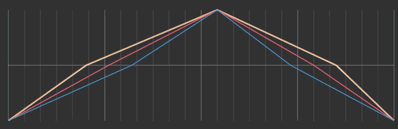
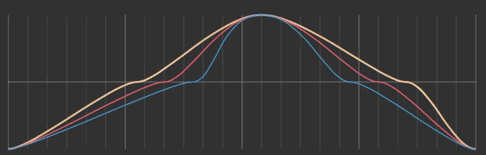
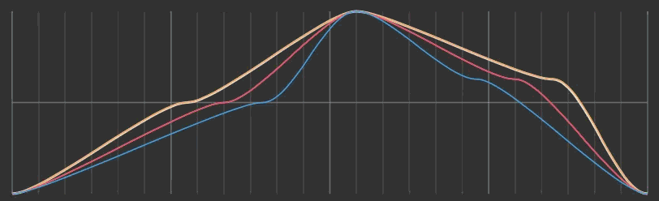

# Transit Module


Requires [itimemodule.md](time-module/itimemodule.md "mention") and [icalendarmodule.md](time-module/icalendarmodule.md "mention")


<a href="https://github.com/DistantLandsProductions/com.distantlands.cozyweather.core/blob/main/Runtime/Modules/CozyTransitModule.cs" class="button secondary" data-icon="code">View on GitHub</a>

<figure><figcaption></figcaption></figure>

## Overview

The Transit module changes the sun's position in the sky based on the current time and date. It is most useful for changing the length of the day and night relative to each other, maintaining beautiful sunrises and sunsets longer than natural to let your players enjoy a quiet moment, and changing the day/night ratio based on the season.

Transit hooks into the Time Module's [OnModifyTime](time-module/#events) event and modifies the day percentage before it is sent to the Atmosphere module. This lets you pick a different "time" to use when displaying the atmosphere based on a function of the actual time.

### Sun Transit

The sun transit sets the default behavior for the sun modification. There are three modes that you can use: linear day, simple curve, and advanced curve.

#### Linear Day

<figure><figcaption></figcaption></figure>

Linear day lets you set a time for each major sun transit event (sunrise, solar noon, sunset, and solar midnight) and the sun will linearly interpolate between them with no smoothing. This is a very simple way to use Transit, and leads to little "elbows" on your transit graph.

#### Simple Curve

<figure><figcaption></figcaption></figure>

Simple curve adds the ability to set the weight of different transit events. A higher weight means a longer time spent at that particular "time". You can use this feature to have longer sunsets and sunrises or rapidly transition from day to night.

#### Advanced Curve

<figure><figcaption></figcaption></figure>

The advanced curve lets you also set the sun's height at different transit events. If you want the sunset to have to sun 10 degrees above the horizon so that you can see it for longer, this is how to accomplish that!

### Seasonal Variation

<figure><figcaption></figcaption></figure>

Seasonal variation lets you adjust the ratio of day to night in the graph based on the season. You can individually set the Spring, Summer, Fall, and Winter adjustments. Positive values spread sun rise and set times apart which lengthens the day. Negative values pull them closer which shortens the day. Typically, your Spring and Fall offsets will be the same, Summer will be positive (+0.3 is a good starting value) and Winter will be the inverse of Summer (-0.3 in this case).

## Usage Examples

<details>

<summary>Make Nights Shorter Than Days</summary>

In your sun transit settings, adjust your sunrise and sunset times so that they are further apart. An unmodified day curve is 6:00 AM, 12:00 PM, 6:00 PM, 12:00 AM. A longer day would pull sunrise back to 5:00 AM and push sunset to 7:00 PM.

<figure><figcaption></figcaption></figure>

</details>

<details>

<summary>Get Today's Sunrise or Sunset Time</summary>

```csharp
// To get the current sunrise and sunset time in C#, 
// all you need to do is poll the active Transit module 

// Get the Transit Module
CozyWeather.Instance.GetModule(out CozyTransitModule transit);

// Get the sunrise and set times
MeridiemTime sunrise = transit.SunriseTime;
MeridiemTime sunset = transit.SunsetTime;
```

</details>


## Widgets

<table data-view="cards"><thead><tr><th></th><th><select><option value="OBED6ZmA2lxZ" label="Small" color="blue"></option><option value="FZGc4BhztoCa" label="Medium" color="blue"></option><option value="CC3yrvOgAGU1" label="Large" color="blue"></option></select></th><th></th><th data-hidden data-card-cover data-type="image">Cover image</th></tr></thead><tbody><tr><td><h3>Transit Graph </h3></td><td><span data-option="CC3yrvOgAGU1">Large</span></td><td>Shows the sun's position in the sky after applying the Transit modifier.</td><td data-object-fit="contain"><a href="../../.gitbook/assets/image (22).png">image (22).png</a></td></tr></tbody></table>

***

## API

### Properties

<table><thead><tr><th width="148.33331298828125">Name</th><th width="121.6666259765625">Type<select><option value="EKyPUQoLDXZT" label="bool" color="blue"></option><option value="FEKO6mTFyhqJ" label="Type[]" color="blue"></option><option value="ghDsMLeQx4f6" label="MeridiemTime" color="blue"></option><option value="E2MHJUww79F8" label="MeridiemDay" color="blue"></option><option value="hUvr0sjUuoir" label="MeridiemDate" color="blue"></option></select></th><th>Description</th></tr></thead><tbody><tr><td>SunriseTime</td><td><span data-option="ghDsMLeQx4f6">MeridiemTime</span></td><td>Get the sunrise time today. Updates when day changes</td></tr><tr><td>SunsetTime</td><td><span data-option="ghDsMLeQx4f6">MeridiemTime</span></td><td>Get the sunset time today. Updates when day changes</td></tr><tr><td>SummerSolstice</td><td><span data-option="hUvr0sjUuoir">MeridiemDate</span></td><td>Gets the longest day of the year. Currently returns June 20</td></tr><tr><td>WinterSolstice</td><td><span data-option="hUvr0sjUuoir">MeridiemDate</span></td><td>Gets the shortest day of the year. Currently returns Dec 21</td></tr></tbody></table>

### Methods

<table><thead><tr><th width="198.33331298828125">Name</th><th width="83.6666259765625">Type<select><option value="EKyPUQoLDXZT" label="bool" color="blue"></option><option value="FEKO6mTFyhqJ" label="Type[]" color="blue"></option><option value="pHA54vS6gX5X" label="float" color="blue"></option></select></th><th>Description</th></tr></thead><tbody><tr><td>ModifyDayPercentage</td><td><span data-option="pHA54vS6gX5X">float</span></td><td><p>Modifies an input based on the sun transit curve. </p><p></p><p>E.g., in a situation where the sun would be 25% of the way through it's path, what percentage would it actually be?</p></td></tr></tbody></table>

### Inherited

#### Properties

<table><thead><tr><th width="148.33331298828125">Name</th><th width="83.6666259765625">Type<select><option value="EKyPUQoLDXZT" label="bool" color="blue"></option><option value="FEKO6mTFyhqJ" label="Type[]" color="blue"></option></select></th><th>Description</th></tr></thead><tbody><tr><td>Active</td><td><span data-option="EKyPUQoLDXZT">bool</span></td><td>Set whether the module is active and enabled</td></tr><tr><td>Requirements</td><td><span data-option="FEKO6mTFyhqJ">Type[]</span></td><td><p>List up to 5 required modules on the system in order for this module to be added.</p><p>Use the DependsOn&#x3C;Types> method to get the list of types.</p></td></tr></tbody></table>

#### Public Methods

<table data-search="true"><thead><tr><th width="261.6666259765625">Name</th><th width="81">Type<select><option value="EKyPUQoLDXZT" label="bool" color="blue"></option><option value="FEKO6mTFyhqJ" label="Type[]" color="blue"></option><option value="3xR5IBfbjYVq" label="void" color="blue"></option></select></th><th>Description</th></tr></thead><tbody><tr><td>ResetModule</td><td><span data-option="3xR5IBfbjYVq">void</span></td><td>Resets the module to all default settings</td></tr><tr><td>InitializeModule</td><td><span data-option="3xR5IBfbjYVq">void</span></td><td>Runs when the module is added and when the game starts</td></tr><tr><td>DeinitializeModule</td><td><span data-option="3xR5IBfbjYVq">void</span></td><td>Runs when the module is removed and when the game ends</td></tr><tr><td>CheckIfModuleCanBeRemoved</td><td><span data-option="EKyPUQoLDXZT">bool</span></td><td>Checks if this module has dependencies that prevent it from being removed</td></tr><tr><td>CheckIfModuleCanBeAdded</td><td><span data-option="EKyPUQoLDXZT">bool</span></td><td>Checks if this module has any conflicts that prevent it from being added</td></tr><tr><td>SetupModule</td><td><span data-option="3xR5IBfbjYVq">void</span></td><td>Runs when the module is added to the weather manager but before the initialize module function.</td></tr><tr><td>OnSceneLoaded</td><td><span data-option="3xR5IBfbjYVq">void</span></td><td>Runs when a scene is loaded</td></tr><tr><td>OnSceneUnloaded</td><td><span data-option="3xR5IBfbjYVq">void</span></td><td>Runs when a scene is unloaded</td></tr></tbody></table>
