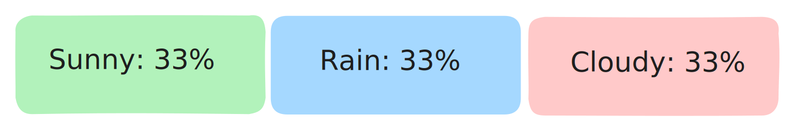

# Chance

## What is a Weighted Random? 

### Overview 

A weighted random is a method of selecting random numbers where each possible outcome is assigned a probability weight. Unlike true random selection, where every outcome has an equal chance of being selected, weighted randomization alters these chances based on the weights. This means that some outcomes are more likely to occur than others, depending on their assigned weights.

COZY uses weighted random numbers for many functions. Weather forecasting, ambience selection, and more are all done using the power of this pseudo-random functionality.

### Advantages of Weighted Random 

Weighted random selection offers several benefits when implemented in applications like COZY:

* **Tailored Experience**: By adjusting the weights, COZY can tailor the user experience. For example, more favorable weather conditions can be made more likely in a forecast, enhancing user satisfaction.
* **Dynamic Adjustment**: The system can dynamically adjust the weights based on user feedback or preferences. If users enjoy a specific Color Block or ambience more, these can be programmed to appear more frequently.
* **Creativity and Variety**: Using weighted random allows COZY to introduce a creative and varied experience each time. It ensures that the app remains fresh and engaging by occasionally introducing less common outcomes.

## Weighted Random Variables 

Anywhere that a pseudo-random value is used, there are a few variables that you will always be able to tweak.

#### Likelihood or Chance 

This is the base chance of this outcome. In a standard random function each outcome has a chance of 1 meaning that each outcome is equally likely. A chart of the ratio of outcomes will look approximately like this:

While the next number is always random, by the end of the rolls there will be about the same number of each possible outcome.

If you were to set an outcome (such as sunny) to have a chance of 2, this drastically changes the outcome set. Now that outcome has a higher chance of occurring and will be twice as likely as the other outcomes. Now our chart looks like this:

## Chance Effectors 

While that helps to make certain weather types more rare than others, it does not necessarily reflect the real world. In the real world, the weather forecast has many factors that contribute to what happens outside our windows such as temperature, humidity, etc. This is reflected in COZY through the use of **chance effectors**. Chance effectors function as multipliers for our base chance by taking in a variable, charting it on a curve and outputting a multiplier

<figure><figcaption></figcaption></figure>

In our simulation, there are several variables that we can choose from to change our base chance.

* Temperature
* Precipitation
* Year percentage
* Time
* Accumulated Wetness
* Accumulated Snow
