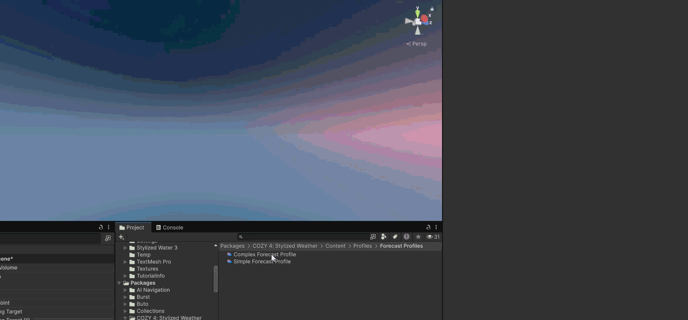
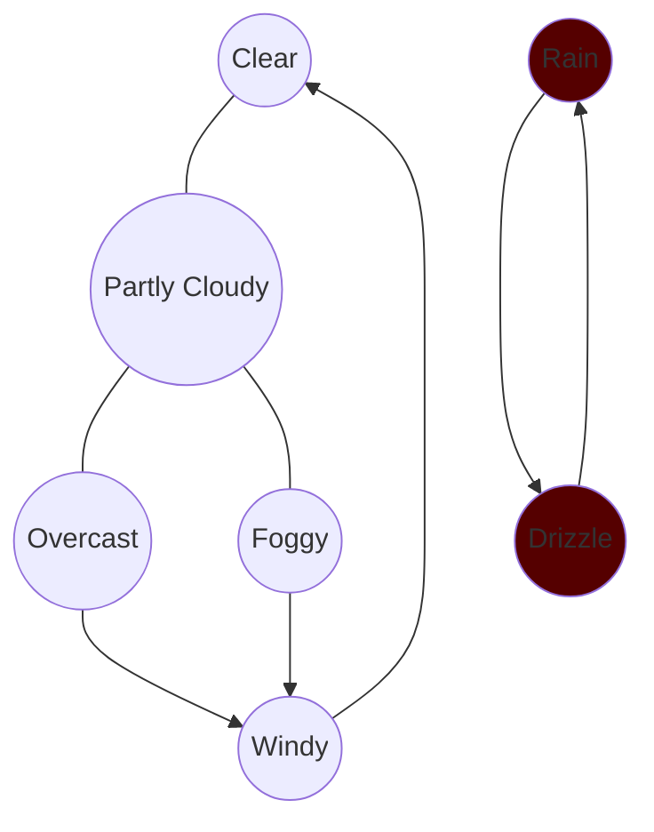

# Forecasting

Forecasting allows you to "predict" what weather will occur in the future and modify the player's sequential experience of the weather. You can edit all of these settings in a [forecast-profile.md](../profiles/forecast-profile.md "mention") using the Forecast Window.

## Getting Started

The forecast profile is a collection of _forecastable profiles_. A forecastable profile is a [weather-profile.md](../profiles/weather-profile.md "mention") with specific rules describing what types of profiles can follow it. These work together to form a chain loop that lets your weather simulation run in an effective way.


A good general rule of thumb to follow when designing a forecast is that **slower transitions tend to feel more natural**. If one second you have clear skies and the next it is a raging blizzard, it will feel very unnatural.

You can use the [tag system](https://app.gitbook.com/o/8BSPwfZaF6QMPy2VJpaj/s/Ob7r9cp7YUzVvftisWP3/~/edit/~/changes/1/using-cozy/utilities/forecasting#tags) for easier categorization and rule creation


The forecast window is your best friend when it comes to creating forecasts. It abstracts all of the details of keeping track of which profiles can follow each other so that you can focus on your world building. To open the forecast window, select a [forecast-profile.md](../profiles/forecast-profile.md "mention") or create a new one (Assets/Create/Distant Lands/Cozy/Forecast Profile) and click edit forecast

<figure><figcaption></figcaption></figure>

The window lets you add weather profiles to the forecast. Once profiles are added, you can select them on the left panel to see what weather profiles may precede and follow it as well as the rules.

<figure><figcaption></figcaption></figure>

On the right, you can adjust the weather profile's description, icon, and tag as well as their [chance.md](chance.md "mention").

##

## Forecasting Rules

A forecasting rule defines a subset of forecastable profiles and a relationship to the preceding profile. Each rule can have one of three behaviors:

<table data-view="cards"><thead><tr><th align="center"></th><th align="center"></th><th></th></tr></thead><tbody><tr><td align="center"><h2><i class="fa-check">:check:</i></h2></td><td align="center"><h3>Force Include</h3>

</td><td>Forces the profile selected by this rule to follow the preceding profile.</td></tr><tr><td align="center"><h2><i class="fa-x">:x:</i></h2></td><td align="center"><h3>Force Exclude</h3>

</td><td>Prevents the profiles selected by this rule from following the preceding profile.</td></tr><tr><td align="center"><h2><i class="fa-wrench">:wrench:</i></h2></td><td align="center"><h3>Modified Chance</h3>

</td><td>Allows the profiles selected by this rule to follow the preceding profile, but modify the chance so they are less likely (variable)</td></tr></tbody></table>


The default behavior for a weather profile when it is first added to the forecast is **force exclude all.** You will need to manually include profiles in order to prevent [#dead-ends](forecasting.md#dead-ends "mention"). Dead ends are automatically resolved by selecting any profile after which likely is not the desired behavior!


Each rule also has a selection modifier that automatically selects a subset of sibling profiles based on a ruleset

### Any

Rule applies to any profile in the forecast.

### By Profile

Lets you select specific profiles that this rule will apply to.

### By Tag

Automatically selects profiles that overlap with the tag selection.&#x20;

## Lateral Shifts

<figure><figcaption></figcaption></figure>

Sometimes, a weather will play so long that the initial conditions that it was forecast for have changed so drastically that it doesn't make sense to continue playing. For example, a snow profile may play during a warming period during which the temperature rises from 30° F to 40° F over a few hours. When this occurs, we need to do a **lateral shift** to a related profile that doesn't break the rules.


Why not just jump forward instead of creating a lateral shift? Moving forward in the forecast will mess up all the calculations that have been done based on the upcoming forecast because the weather timer gets reset. By laterally shifting, we can play a different profile without messing with the existing forecast at all!


### Create a Lateral Shift

Add a new entry under the lateral shifts list. This will let you define a condition and a profile. When the condition is true, the weather will immediately transition to the defined profile.

## Common Situations

### Dead Ends

<figure><figcaption></figcaption></figure>

A dead end occurs when a profile is not connected to any other profiles after itself and cannot correctly determine what behavior makes sense following this. Dead ends are automatically resolved by defaulting to allow any profile after the preceding profile which may not be the ideal behavior. You can resolve a dead end manually by adding a rule that allows at least one weather profile to follow the preceding profile.

### Headless

<figure><figcaption></figcaption></figure>

A headless weather profile does not have any profiles that can forecast it. Because it is missing this top connection, it can never be scheduled and is dead weight for your system. To resolve, either remove the profile or add a rule to another profile that allows this to be scheduled.

### Islands

Sometimes a profile has connections above and below itself but still will never be forecast because these connections are cyclical. An island is a chunk of your forecast profile that cannot be scheduled because it lacks any connections with another chunk of your forecast profile.

These errors will often be **silent** and require planning to ensure that all of your profiles can actually be scheduled. For an easy fix, use something like the mostly cloudy profile that can serve as a bridge between any profile when needed. This creates an easy central link to bridge between different profiles.

### Self Reference

<figure><figcaption></figcaption></figure>

Self referencing is when a profile is able to forecast itself (denoted in green) leading to a cycle of the same weather pattern over and over again. This can be normal, but may also seem boring or unintentional in a game context. To change this, add a new rule that **Force Excludes** by **Profile** and set the profile to the initial profile.&#x20;
